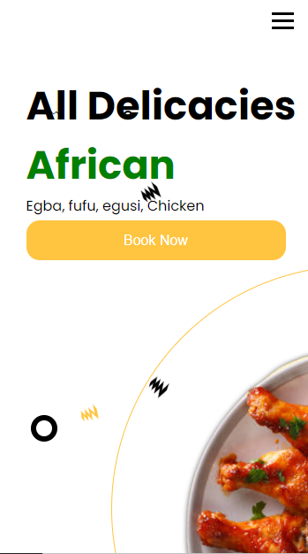

# Restaurant Page
<!-- Adding a image here -->
## Preview

## Technologies used
* Webpack
* HTML
* JavaScript
* Scss
* Netlify
* Swiper js
## Notes
* Used Webpack for bundling and distribution.
* Used Scss which was easy to get the hang of because of it's similarity to CSS. Used both mixins and include and other SCSS properties to achieve the Design.
* DOM Manupulation
* Made a caoursel for both the tablet and mobile using swiper js 
[Live Preview](www.afrirokitchen.netlify.app)

